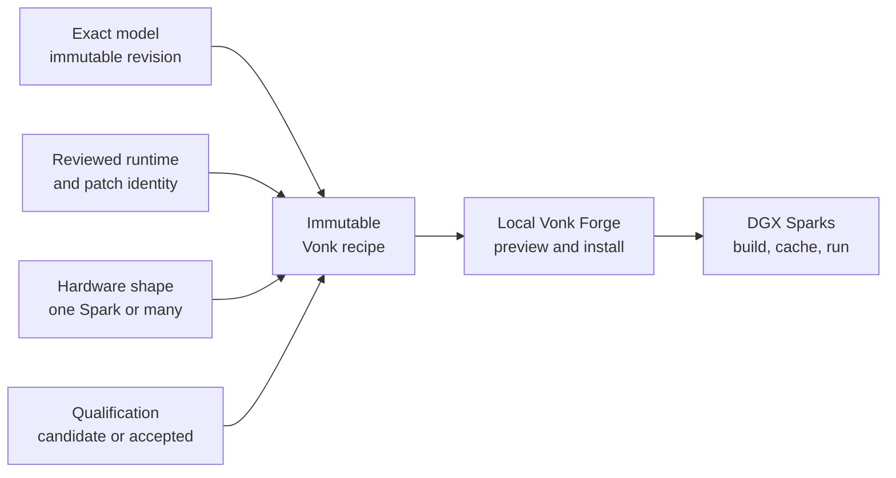

# Vonk Forge recipe library

**Reproducible local AI starts with a recipe you can inspect.**

This repository is the public standard library for
[Vonk Forge](https://vonkforge.ai). Each recipe binds an exact model revision,
runtime distribution, topology, capacity contract, source bundle, and
qualification state into one reviewable execution definition.

[Browse the catalog](https://vonkforge.ai/recipes) ·
[Install Vonk Forge](https://vonkforge.ai/install) ·
[Controller repository](https://github.com/CarstVaartjes/vonk-forge) ·
[Publishing guide](https://vonkforge.ai/publish)

## What a recipe does



A recipe tells the local controller **what** may be built and run. The controller
still checks the actual fleet, shows placement and resource effects, and requires
operator confirmation before changing anything.

This repository contains declarations and deterministic public source contexts.
It contains **no model weights, container layers, credentials, fleet state, or
private controller data**.

## Read a catalog entry in 30 seconds

| Fact | What it answers |
| --- | --- |
| Model version | Exactly which upstream weights and revision will be used? |
| Runtime distribution | Which runtime build and immutable source does the recipe select? |
| Topology | Does it need one Spark, a fixed multi-node group, or another declared shape? |
| Capacity | What are the maximum download, installed-disk, and runtime-memory requirements? |
| Executable contract | Does the document completely describe a runnable attempt? |
| Qualification | Is it still a candidate, or has its required container and physical Spark evidence been accepted? |

**Installable does not mean accepted.** A complete executable candidate may be
installed with explicit opt-in so new work can be tried. Accepted defaults require
the declared ARM64 container and physical Spark acceptance gates. Blocked research
targets have no installable recipe.

## What lives where

| Path | Purpose |
| --- | --- |
| `recipes/` | One immutable execution binding per model and topology |
| `recipe-releases/` | Semantic versions and bounded operator-facing changes for each recipe digest |
| `model-groups/`, `models/`, `model-versions/` | Exact model identity, artifacts, and provenance |
| `runtime-distributions/`, `patch-bundles/` | Exact runtime and patch identity selected by recipes |
| `adapters/` | Deterministic public build contexts for model-specific behavior |
| `qualification/` | Recipe-owned smoke cases, input assets, reviewed campaign authorities, and generated digest bindings |
| `model-targets/` | Research ledger of candidate, accepted, and blocked upstreams |
| `catalog-index.json` | Generated digest-bound closure used for efficient verified import |

Harness implementations, schema authority, installation, controller state, and
Spark acceptance live in
[`vonk-forge`](https://github.com/CarstVaartjes/vonk-forge). Recipes reference
harnesses by exact identity; they do not reimplement control logic.

## Browse and install

The easiest path is the public [recipe catalog](https://vonkforge.ai/recipes),
followed by **Import recipe** in your private Web Controller. The controller
shows the immutable source, local status, qualification, hardware fit, and
change preview before import or installation.

For an audited checkout-to-controller path, use the platform repository's
`scripts/import-recipe-library`. It validates first and defaults to a dry run:

```bash
cd ../vonk-forge
scripts/import-recipe-library
```

Applying requires an explicit local controller URL and protected administrator
token file. Candidate recipes also require a separate explicit opt-in:

```bash
scripts/import-recipe-library \
  --control-url https://your-private-controller.example \
  --token-file /private/path/admin-token \
  --apply

scripts/import-recipe-library \
  --control-url https://your-private-controller.example \
  --token-file /private/path/admin-token \
  --include-candidates \
  --apply
```

## Add or update a recipe

1. Add or revise the model entities and immutable artifact metadata.
2. Select a built-in harness and pin the runtime distribution plus any patch bundle.
3. Declare one recipe for one exact topology; replicas and distributed ranks are
   not interchangeable.
4. Add or update the recipe's entry in `qualification/definitions.json`; source
   definitions never contain copied recipe digests.
5. Add or update `recipe-releases/<recipe-slug>.json`, binding the semantic
   version to the canonical recipe digest.
6. Reference companion weights as explicit dependencies. Do not hide mutable
   downloads or a second model family inside an adapter.
7. Keep source contexts deterministic and free of secrets. Input-dependent jobs
   must declare the matching read-only input contract.
8. Run validation and the required container/Spark evidence before advancing
   qualification.

### Build contract and Podman boundary

Recipes declare every Podman build input that authors may vary. The Controller
signs these values into the build request and the Spark agent translates them to
the corresponding Podman options:

| Recipe field | Build behavior |
| --- | --- |
| `build.context` | Exact source bundle used as the build context |
| `build.dockerfile` | Dockerfile selected with `--file` |
| `build.target` | Optional multi-stage target selected with `--target` |
| `build.platform` | Target platform selected with `--platform` |
| `build.arguments` | Typed, bounded `--build-arg` values |
| `build.network` | No network, or hostname-allowlisted public egress |
| `build.options.additional_contexts` | Named `--build-context` directories inside the signed source bundle |
| `build.options.annotations` | Bounded image `--annotation` metadata |
| `build.options.environment` | Typed final-image `--env` values |
| `build.options.format` | `--format=oci` or `--format=docker` |
| `build.options.identity_label` | Explicit `--identity-label` behavior |
| `build.options.ignorefile` | Optional `--ignorefile` inside the signed source bundle |
| `build.options.jobs` | Bounded multi-stage `--jobs` concurrency |
| `build.options.labels` / `layer_labels` | Bounded `--label` and `--layer-label` metadata |
| `build.options.layer_compression` | Typed `--disable-compression` behavior |
| `build.options.layers` | Explicit `--layers` behavior |
| `build.options.no_hostname` / `no_hosts` | Explicit generated hostname/hosts-file behavior |
| `build.options.omit_history` | Explicit `--omit-history` behavior |
| `build.options.os_features` / `os_version` | Bounded target image metadata |
| `build.options.shm_bytes` | Bounded build-container `--shm-size` |
| `build.options.skip_unused_stages` | Explicit `--skip-unused-stages` behavior |
| `build.options.squash` | No squash, `--squash`, or `--squash-all` |
| `build.options.timestamp` | Optional bounded deterministic `--timestamp` |
| `build.options.unset_environment` / `unset_labels` | Bounded `--unsetenv` and `--unsetlabel` names |
| `build.resources.cpu_cores` | Maximum logical CPU cores |
| `build.resources.memory_bytes` | Maximum build memory |
| `build.resources.processes` | Maximum concurrent processes and threads |
| `build.resources.temporary_bytes` | Temporary build-storage envelope |
| `build.resources.download_bytes` | Declared base/download storage envelope |
| `build.resources.timeout_seconds` | Maximum build duration |
| `build.security.capabilities` | Bounded rootless `--cap-add` entries after `--cap-drop=all` |

This is an inclusive list: `build`, `build.options`, and `build.security` reject
unknown properties. There is deliberately no raw `podman_args` escape hatch.
The agent starts with `--cap-drop=all` and adds only `CHOWN`, `DAC_OVERRIDE`,
`FOWNER`, `FSETID`, `KILL`, `MKNOD`, `NET_BIND_SERVICE`, `SETFCAP`, `SETGID`,
`SETPCAP`, `SETUID`, or `SYS_CHROOT` when the recipe explicitly requests them.
Those capabilities apply only inside Podman's rootless user namespace.

The remaining Podman 4.9 build flags are deliberately platform-owned or absent:

- Fixed platform policy: `--arch`, `--os`, `--variant`, `--all-platforms`,
  `--authfile`, `--cert-dir`, `--cgroup-parent`, `--cgroupns`, CPU/cpuset/memory
  flags, `--force-rm`, `--http-proxy`, `--iidfile`, `--ipc`, `--isolation`,
  `--logfile`, `--logsplit`, `--memory-swap`, `--no-cache`, `--output`, `--pid`,
  `--pull=never`, `--quiet`, retry settings, `--rm`, `--security-opt`, `--stdin`,
  generated `--tag`, `--tls-verify`, process `--ulimit`, `--userns` and UID/GID
  maps, and `--uts`.
- Rejected because they expose host authority, credentials, uncontrolled egress,
  mutable remote state, or bypass immutable base inputs: `--add-host`,
  `--build-arg-file`, `--cache-from`, `--cache-to`, `--cache-ttl`, `--cpp-flag`,
  `--creds`, `--cw`, `--decryption-key`, `--device`, DNS overrides, `--from`,
  `--group-add`, `--hooks-dir`, `--manifest`, `--runtime-flag`, `--secret`,
  `--sign-by`, `--ssh`, and `--volume`.
- Podman compatibility no-ops such as `--compress` and
  `--disable-content-trust` are not represented.

A new Podman release or new recipe-selectable behavior must update this closed
schema, signed Controller-to-agent contract, agent translation, and tests before
a recipe can use it. An unknown option fails recipe validation.

Generate and verify the catalog and qualification closures after changing
recipes, releases, qualification definitions, entities, or adapters. The same
tool computes each recipe digest and writes it into the generated
`qualification/qualification-index.json`:

```bash
tools/build-catalog-index
tools/build-catalog-index --check
../vonk-forge/scripts/validate-recipe-library \
  --library-root "$PWD" \
  --platform-root ../vonk-forge \
  --json
```

CI checks JSON schema and semantics, exact dependency resolution, deterministic
recipe identity, source-context boundaries, release history, catalog freshness,
and credentials. GitHub Actions is the only publication path.

## Version and trust model

- `main` is the development library. Production controllers consume an approved
  immutable release tag and record the exact commit in the import receipt.
- `catalog-index.json` binds each recipe to its complete entity closure and the
  immutable Git blobs in its source context.
- Executable recipe digests do not change when release notes change. Release
  sidecars map semantic versions and upgrade effects onto those immutable digests.
- Mutable names such as `latest` are never execution authority.
- Primary upstream sources establish identity. Community reports and independent
  benchmarks are discovery signals, not acceptance evidence.

## Audit upstream drift

Immutable pins are reproducible but can become old. `tools/check-upstream-drift`
compares catalog revisions with the channels declared in `upstream-watch.json`
without rewriting any recipe or entity:

```bash
GITHUB_TOKEN=... tools/check-upstream-drift \
  --fail-on-drift \
  --output upstream-drift.json
```

Exit `0` means automated watches are current, `1` means verification failed,
and `2` means reviewable drift was found. The weekly GitHub workflow publishes
both table and JSON reports; upstream network state is deliberately not a
required pull-request gate.
